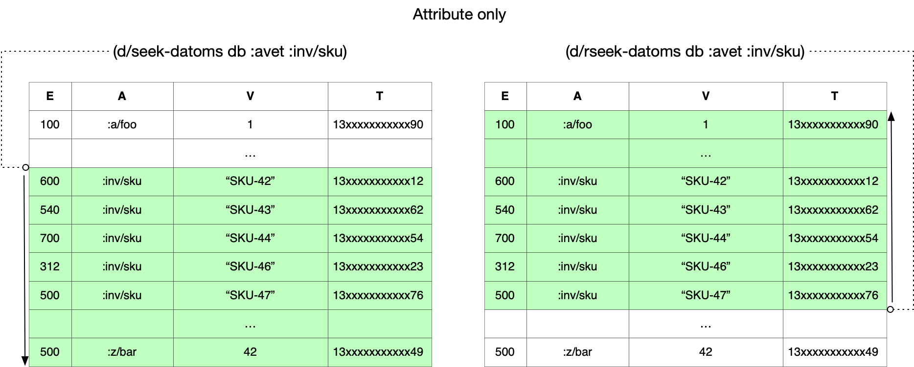
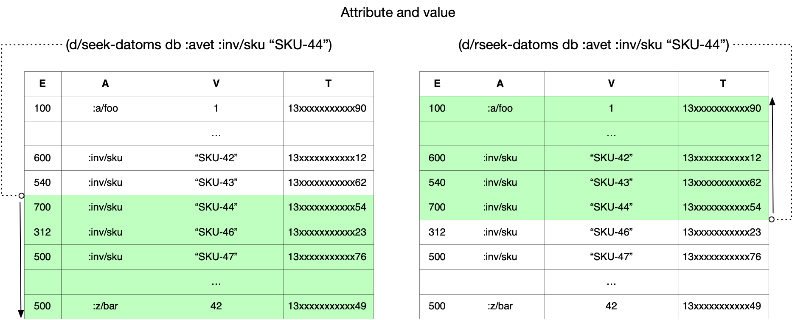
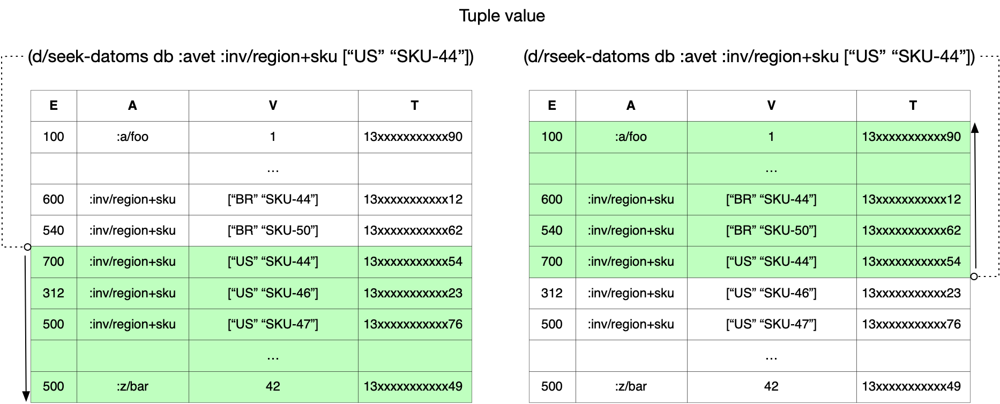
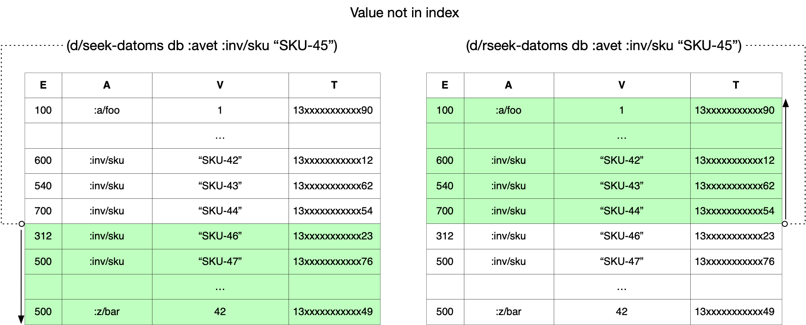
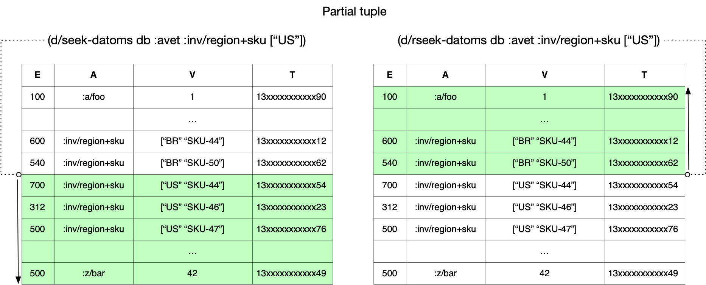
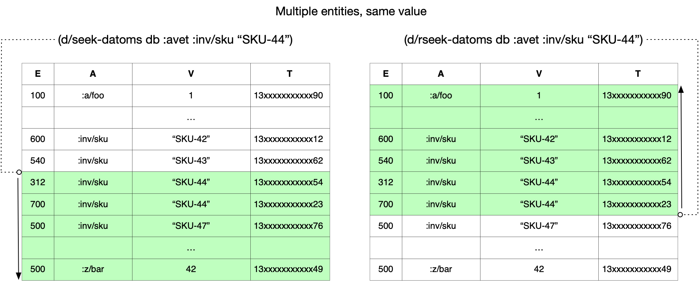

## (r)seek-datoms

The Peer API provides index access to raw datoms via `seek-datoms` and its reverse complement `rseek-datoms`.

There are two concepts you need to understand when using (r)seek-datoms: seek and consume. You say where to seek and (r)seek-datoms will return datoms in the respective direction from that point in the specified index. It will continue conveying datoms lazily until either you stop consuming them or you reach the end of the index. All database values and indexes are supported.

## seek-datoms

`(seek-datoms db index & components)`

Returns datoms forward from the point in the index where the components would reside.

## rseek-datoms

`(rseek-datoms db index & components)`

Returns datoms backward from the point in the index where the components would reside.

## Seek Position

You say where to seek by supplying one or more components of a datom in index-sort order. Regardless of whether the supplied datom exists, `seek-datoms` will start before the lowest match and `rseek-datoms` after the highest.

The following pictures illustrate different aspects of seek positioning.

Each additional component specifies a more precise position in the index.

When the supplied component does not exist in the index, both APIs start at the same point.

When multiple entities possess the same value, `seek-datoms` starts before the lowest one and `rseek-datoms` after the highest.

