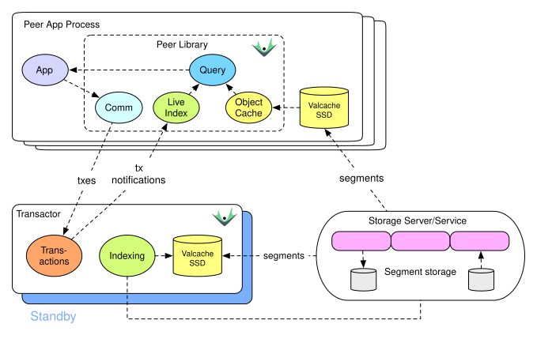

## Valcache

Everything gets better when data moves closer to processing. Datomic Valcache is a local, immutable, high-capacity, durable, SSD-backed, low latency cache for Datomic. Valcache also:

- Is transparent to application code
- Caches segments of [index](https://docs.datomic.com/query/indexes.html#efficient-accumulation) and [log](https://docs.datomic.com/api/log.html#implementation), which are immutable values that never expire
- Runs on the same instance as a Datomic process, serving that process
- Is backed by an SSD, providing a higher capacity per price than a memory-backed cache
- Stays hot across process restarts
- Reduces the load placed on storage, which is particularly helpful for provisioned storage such as DynamoDB



## Prerequisites

Valcache relies on an SSD with the `strictatime` and `lazytime` flags set. When you mount an SSD for Valcache, you **must** set the `strictatime` and `lazytime` flags.

## Configuration

To configure Valcache you need to set properties in your [transactor](https://docs.datomic.com/operation/transactor.html) properties file (for transactors) or set Java [system properties](https://docs.datomic.com/operation/system-properties.html) (for peers):

| Transactor property | System property | Value |
| --- | --- | --- |
| valcache-path | datomic.valcachePath | Directory on an SSD that meets [prerequisites](#prerequisites) |
| valcache-max-gb | datomic.valcacheMaxGb | Maximum space valcache will try to use |

Transactor example:

```
valcache-path=/opt/valcache
valcache-max-gb=100
```

Peer example:

```
java -Ddatomic.valcachePath=/opt/valcache/ -Ddatomic.valcacheMaxGb=100 {your-args}
```

## Monitoring Valcache

Valcache entries in the operational [log](https://docs.datomic.com/operation/configuring-logging.html) begin with `:valcache`. In particular, you can search for `:valcache/start` to see the settings used to launch Valcache.

The `Valcache` metric can be used to monitor Valcache utilization and performance.

| Metric | Meaning |
| --- | --- |
| Average | Cache hit ratio, from 0 (no hits) to 1 (all hits) |
| Sum | Number of cache hits |
| Samples | Number of cache requests |

## Valcache vs. Memcached

You can choose [memcached](https://docs.datomic.com/operation/caching.html#memcached) instead of, or in addition to, Valcache, and you can make this choice independently per process.

When used in Datomic, Memcached differs from Valcache in:

- Memcached can run on separate instances, with lifecycles independent of transactor and peer processes
- Memcached can be clustered
- Memcached is not specific to Datomic and can support Datomic while simultaneously serving other clients

The Datomic team believes that for most Datomic usage, Valcache will be more effective than Memcached, providing a larger, hotter cache with similar latency at a lower price. However, if your deployment strategy prevents new processes from using existing SSDs, Memcached may be a better fit. Two common cases for this are:

- Your peer or transactor instances do not have SSDs.
- New processes cannot reuse SSDs that were populated by a previous process. This is often the case in cloud deployment, where instances and their disks are ephemeral.

> If you are running on AWS, check out [Datomic Cloud](https://www.datomic.com/index.html) which uses Valcache automatically.